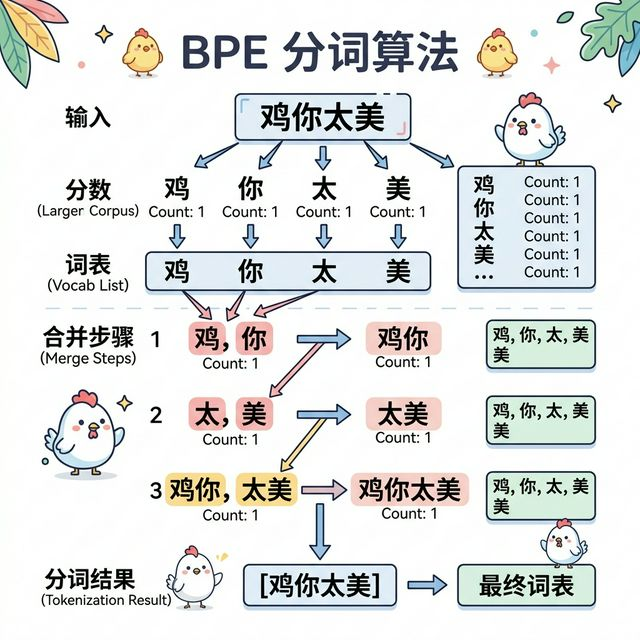
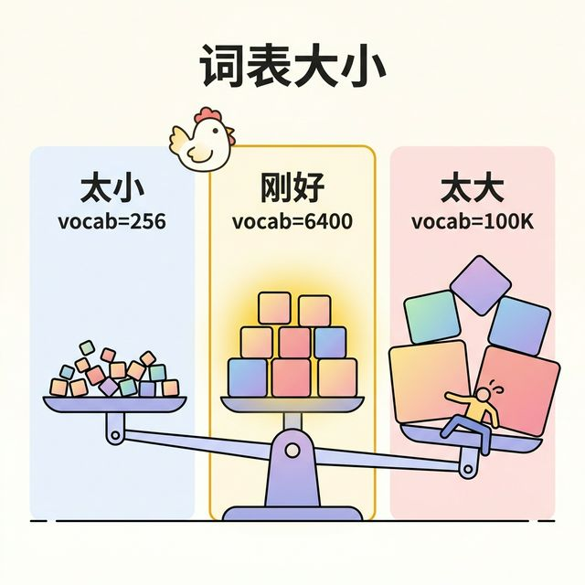
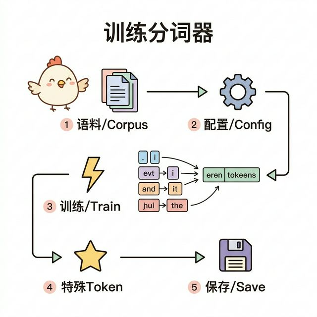

<p align="center"></p>
<h2 align="center">ikun-tokenizer</h2>
<p align="center"><b>分词器是怎么炼成的</b><br/><sub>Level 1 | 基础篇</sub></p>

<p align="center">
  
  
  
</p>

---

> 为什么分词器能认识"鸡你太美"但不认识"小黑子"？因为练习时长不够！

本仓库用**最通俗的语言 + 可运行的代码**讲解分词器的原理和训练方式。看完之后，你就能自己训练一个 ikun 专属分词器了。

## 目录

| # | 章节 | 内容 | 一句话总结 | 图示预览 |
|---|------|------|-----------|---------|
| 1 | [BPE 分词算法](docs/01-bpe.md) | Byte Pair Encoding 原理 | 从字符开始，合并高频对，组装成子词 |  |
| 2 | [词表大小的学问](docs/02-vocab.md) | 为什么 vocab_size=6400 | 太小拆太碎，太大带不动，6400 刚刚好 |  |
| 3 | [特殊 Token](docs/03-special-tokens.md) | im_start / im_end 的设计 | 对话的"舞台指令"，告诉模型谁在说话 |  |
| 4 | [训练分词器](docs/04-train-tokenizer.md) | 动手训练完整流程 | 5 步搞定，不需要 GPU |  |

## 快速开始

```bash
# 安装依赖
pip install tokenizers

# 训练一个自己的分词器
python train_tokenizer.py

# 查看分词效果演示
python tokenizer_demo.py
```

## 你将学到

- BPE (Byte Pair Encoding) 分词算法原理
- 为什么 vocab_size=6400？大了小了会怎样？
- 特殊 token 的设计：`<|im_start|>` / `<|im_end|>` 是什么
- 训练一个 ikun 专属分词器的完整流程
- 分词器如何把"鸡你太美baby鸡你太美"拆成 token

## 核心代码

| 文件 | 说明 |
|------|------|
| [train_tokenizer.py](train_tokenizer.py) | 训练脚本：基于 ByteLevel BPE 训练 vocab_size=6400 的分词器 |
| [tokenizer_demo.py](tokenizer_demo.py) | 演示脚本：展示分词效果、编解码、特殊 token 处理 |

## 知识点

| 概念 | 说明 |
|------|------|
| BPE | 从字符级开始，逐步合并高频字节对 |
| vocab_size | 词表大小，太小=表达力不足，太大=embedding 占太多参数 |
| Special Tokens | `<\|im_start\|>`=对话开始, `<\|im_end\|>`=对话结束 |
| Pre-tokenizer | ByteLevel 预分词，处理多语言 |
| ChatML | 对话格式标准，用特殊 token 区分角色 |

## 阅读建议

- **完全零基础**：先去 [ikun-basics](https://github.com/ikun-llm/ikun-basics) 学基础，再回来
- **有一点基础**：按顺序从第 1 章读到第 4 章
- **只想动手**：直接看第 4 章，跑代码
- **想深入理解**：每章开头有"一句话版本"，细节在正文中

## 系列导航

| Level | Repo | 学什么 |
|-------|------|--------|
| 0 | [ikun-basics](https://github.com/ikun-llm/ikun-basics) | AI 基础知识 |
| **1** | **ikun-tokenizer** <-- 你在这里 | 分词器原理 |
| 1 | [ikun-pretrain](https://github.com/ikun-llm/ikun-pretrain) | 从零预训练 |
| 1 | [ikun-2.5B](https://github.com/ikun-llm/ikun-2.5B) | SFT + LoRA 微调 |
| 2 | [ikun-DPO](https://github.com/ikun-llm/ikun-DPO) | 偏好对齐 |
| 2 | [ikun-GRPO](https://github.com/ikun-llm/ikun-GRPO) | 强化学习 |
| 2 | [ikun-Reason](https://github.com/ikun-llm/ikun-Reason) | 推理模型 |
| 3 | [ikun-MoE](https://github.com/ikun-llm/ikun-MoE) | 混合专家 |
| 3 | [ikun-Distill](https://github.com/ikun-llm/ikun-Distill) | 知识蒸馏 |
| 3 | [ikun-V](https://github.com/ikun-llm/ikun-V) | 多模态 |
| 4 | [ikun-deploy](https://github.com/ikun-llm/ikun-deploy) | 部署 |
