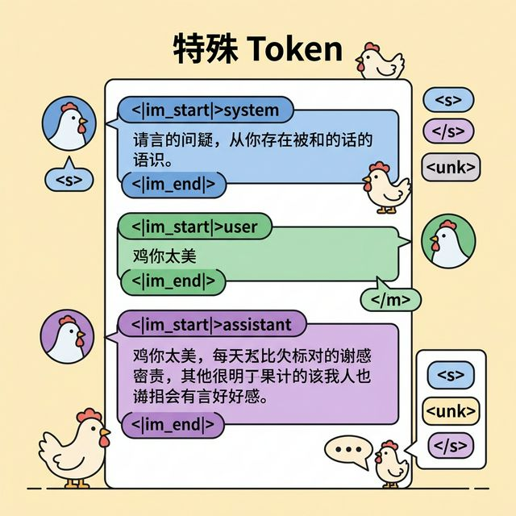

# 第三章：特殊 Token 的设计

> `<|im_start|>` 和 `<|im_end|>` 是什么？为什么需要它们？



---

## 一句话版本

特殊 Token 是分词器预留的"暗号"，告诉模型"这里有特殊含义"——比如对话开始了、对话结束了、遇到了不认识的词。它们不参与 BPE 合并，有自己独立的身份。

---

## 为什么需要特殊 Token？

```
想象一个练习生表演：

普通 token = 表演内容（唱歌、跳舞、rap）
特殊 token = 舞台指令（灯光暗转、开始、结束、中场休息）

如果没有特殊 token：
  "你好请问今天天气怎样天气不错谢谢再见"
  模型分不清哪句是用户说的，哪句是 AI 回的

有了特殊 token：
  <|im_start|>user
  你好请问今天天气怎样
  <|im_end|>
  <|im_start|>assistant
  天气不错
  <|im_end|>
  清清楚楚！
```

---

## ikun 分词器的特殊 Token

```
ikun 分词器使用以下特殊 token：

┌──────────────────┬──────────┬────────────────────────┐
│ Token            │ ID       │ 作用                    │
├──────────────────┼──────────┼────────────────────────┤
│ <unk>            │ 0        │ 未知词（不认识的 token） │
│ <s>              │ 1        │ 序列开始                │
│ </s>             │ 2        │ 序列结束                │
│ <|im_start|>     │ 3        │ 对话消息开始             │
│ <|im_end|>       │ 4        │ 对话消息结束             │
└──────────────────┴──────────┴────────────────────────┘

注意：ID 是示意，实际 ID 取决于训练时的设置
```

---

## 每个特殊 Token 详解

### `<unk>` — 未知 Token

```
当分词器遇到完全不认识的东西时，用 <unk> 代替。

在 BPE 中，理论上不会出现 <unk>：
  因为 ByteLevel BPE 能把任何东西拆成字节
  字节范围 0-255 都在词表里
  所以什么输入都能处理

那 <unk> 还有用吗？
  有！在做字符级或词级分词时可能用到
  保留 <unk> 是一种安全措施——以防万一

比喻：
  <unk> 就像练习生的"自由发挥"卡
  遇到不会的动作，先糊弄过去
  虽然 ikun 什么都会，但有备无患
```

### `<s>` 和 `</s>` — 序列的开始和结束

```
<s>  = "表演开始！"
</s> = "表演结束！谢谢观看！"

作用：
  告诉模型一段文本从哪开始，到哪结束

例子：
  <s> 鸡 你 太 美 </s>
  
  模型看到 <s>：啊，新的一段开始了，注意力重置
  模型看到 </s>：这段结束了，可以输出了

预训练时的格式：
  <s>这是第一篇文章的内容...</s>
  <s>这是第二篇文章的内容...</s>
  
  通过 <s> 和 </s>，模型知道文章的边界在哪
```

### `<|im_start|>` 和 `<|im_end|>` — ChatML 格式

```
这是对话场景的核心特殊 token！

im = "instant message"（即时消息）
这套格式叫 ChatML（Chat Markup Language）

格式：
  <|im_start|>角色
  消息内容
  <|im_end|>

实际例子：

  <|im_start|>system
  你是 ikun-2.5B，一个练习时长两年半的 AI 练习生。
  <|im_end|>
  <|im_start|>user
  你会什么才艺？
  <|im_end|>
  <|im_start|>assistant
  唱、跳、rap、篮球！还有回答问题~
  <|im_end|>

模型通过这些 token 学会了：
  1. 区分 system / user / assistant 三种角色
  2. 知道每条消息在哪里结束
  3. 在 assistant 角色后生成回复
  4. 生成 <|im_end|> 时停止输出
```

---

## 特殊 Token 在训练中的处理

```
重要规则：特殊 token 不参与 BPE 合并！

为什么？

  如果 <|im_start|> 参与 BPE：
    "start" 的字节可能和前面的文字合并
    → 特殊含义被破坏了！

  所以分词时的处理顺序：
    1. 先找到所有特殊 token，保护起来
    2. 对剩余的普通文本做 BPE 分词
    3. 把特殊 token 放回原位

  例子：
    输入："<|im_start|>user\n鸡你太美<|im_end|>"
    
    Step 1: 识别特殊 token
      [<|im_start|>] + "user\n鸡你太美" + [<|im_end|>]
    
    Step 2: 对普通文本做 BPE
      "user\n鸡你太美" → ["user", "\n", "鸡你", "太美"]
    
    Step 3: 合并
      [<|im_start|>, "user", "\n", "鸡你", "太美", <|im_end|>]
    
    Step 4: 转成 id
      [3, 1567, 89, 1024, 2048, 4]
```

---

## 添加特殊 Token 的代码

```python
from tokenizers import Tokenizer

# 加载训练好的分词器
tokenizer = Tokenizer.from_file("ikun_tokenizer.json")

# 添加特殊 token
special_tokens = ["<unk>", "<s>", "</s>", "<|im_start|>", "<|im_end|>"]
tokenizer.add_special_tokens(special_tokens)

# 测试
text = "<|im_start|>user\n鸡你太美<|im_end|>"
encoded = tokenizer.encode(text)
print(encoded.tokens)
# ['<|im_start|>', 'user', '\n', '鸡你', '太美', '<|im_end|>']
```

---

## 完整的对话 Token 序列

```
一轮完整的对话，模型看到的 token 序列：

┌─────────────────────────────────────────────────┐
│                                                 │
│  <s>                          ← 序列开始         │
│                                                 │
│  <|im_start|>system           ← 系统消息开始     │
│  你 是 ikun 练习生             ← 系统提示内容     │
│  <|im_end|>                   ← 系统消息结束     │
│                                                 │
│  <|im_start|>user             ← 用户消息开始     │
│  鸡 你 太 美                   ← 用户输入        │
│  <|im_end|>                   ← 用户消息结束     │
│                                                 │
│  <|im_start|>assistant        ← 助手消息开始     │
│  你 干嘛 哎哟                  ← 模型生成 ←←←    │
│  <|im_end|>                   ← 模型生成停止信号 │
│                                                 │
│  </s>                         ← 序列结束         │
│                                                 │
└─────────────────────────────────────────────────┘

训练时：模型看到完整序列，学习预测下一个 token
推理时：模型从 <|im_start|>assistant 后开始生成
       直到生成 <|im_end|> 停止
```

---

## 本章小结

| Token | 作用 | 比喻 |
|-------|------|------|
| `<unk>` | 处理未知词 | 万能替身演员 |
| `<s>` | 序列开始 | 导演喊"开始！" |
| `</s>` | 序列结束 | 导演喊"卡！" |
| `<\|im_start\|>` | 对话消息开始 | 轮到某人发言 |
| `<\|im_end\|>` | 对话消息结束 | 这个人说完了 |
| ChatML | 对话格式标准 | 剧本格式 |

```
特殊 token 的存在意义：

  普通 token 是"内容"
  特殊 token 是"结构"

  没有结构的内容，就像没有剧本的表演
  练习生在台上不知道什么时候该唱
  什么时候该跳，什么时候该 rap

  有了特殊 token，一切井然有序 🐔
```

---

[← 上一章：词表大小](02-vocab.md) | [下一章：训练分词器 →](04-train-tokenizer.md)
